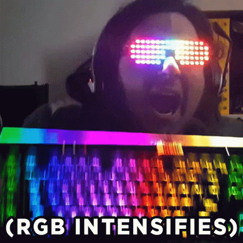

  <a href="https://atypicalesper.github.io/">
    <picture>
      <source media="(prefers-color-scheme: dark)" srcset="https://readme-typing-svg.demolab.com?font=Press+Start+2P&size=14&pause=500&color=00BFFF&center=true&vCenter=true&multiline=true&repeat=true&width=500&height=120&speed=20&lines=Hi%2C+This+is+Tarun%2C;a+software+developer%2C;based+in+Gurugram%2C+India" />
      <source media="(prefers-color-scheme: light)" srcset="https://readme-typing-svg.demolab.com?font=Press+Start+2P&size=14&pause=500&color=7C3AED&center=true&vCenter=true&multiline=true&repeat=true&width=500&height=120&speed=20&lines=Hi%2C+This+is+Tarun%2C;a+software+developer%2C;based+in+Gurugram%2C+India" />
      
    </picture>
  </a>

  

    <picture>
      <source media="(prefers-color-scheme: dark)" srcset="https://github-profile-trophy.vercel.app/?username=atypicalesper&theme=tokyonight&no-frame=false&no-bg=true&margin-w=4&cache_seconds=604800" />
      <source media="(prefers-color-scheme: light)" srcset="https://github-profile-trophy.vercel.app/?username=atypicalesper&theme=flat&no-frame=false&no-bg=true&margin-w=4&cache_seconds=604800" />
      
    </picture>
  

   

  <table align="center">
    <tr>
      <td>
        
      </td>
      <td>
        

          ~ Writing code, occasionally it works 👨🏻‍💻 
          ~ Anime enthusiast (❁´◡`❁) 
          ~ Music &amp; photography 🎶📸 
          ~ Mechanical keyboard enjoyer ⌨️ 
        

      </td>
      <td>
        
      </td>
    </tr>
  </table>

   

  

    
    
    
  

   

  

  <table width="100%">
    <tr>
      <td width="33%" valign="top" align="center">
        <b>👨‍💻 Languages</b>  
        
        
        
        
        
        
        
        
        
      </td>
      <td width="33%" valign="top" align="center">
        <b>🎨 Frontend</b>  
        
        
        
      </td>
      <td width="33%" valign="top" align="center">
        <b>⚙️ Backend</b>  
        
        
        
        
        
        
        
        
        
      </td>
    </tr>
    <tr>
      <td width="33%" valign="top" align="center">
        <b>🤖 AI & ML</b>  
        
        
        
        
        
        
      </td>
      <td width="33%" valign="top" align="center">
        <b>🗄️ Databases & Cloud</b>  
        
        
        
        
        
        
        
        
        
      </td>
      <td width="33%" valign="top" align="center">
        <b>💻 Tools & Platforms</b>  
        
        
        
        
        
        
        
        
        
        
        
      </td>
    </tr>
  </table>

   

  

  

    <table>
      <tr>
        <td>
          <picture>
            <source media="(prefers-color-scheme: dark)" srcset="https://github-profile-summary-cards.vercel.app/api/cards/stats?username=atypicalesper&theme=tokyonight" />
            <source media="(prefers-color-scheme: light)" srcset="https://github-profile-summary-cards.vercel.app/api/cards/stats?username=atypicalesper&theme=github" />
            
          </picture>
        </td>
        <td>
          <picture>
            <source media="(prefers-color-scheme: dark)" srcset="https://streak-stats.demolab.com/?user=atypicalesper&theme=tokyonight&hide_border=false&cache_seconds=604800" />
            <source media="(prefers-color-scheme: light)" srcset="https://streak-stats.demolab.com/?user=atypicalesper&theme=default&hide_border=false&cache_seconds=604800" />
            
          </picture>
        </td>
      </tr>
      <tr>
        <td colspan="2" align="center">
          <picture>
            <source media="(prefers-color-scheme: dark)" srcset="https://github-profile-summary-cards.vercel.app/api/cards/repos-per-language?username=atypicalesper&theme=tokyonight" />
            <source media="(prefers-color-scheme: light)" srcset="https://github-profile-summary-cards.vercel.app/api/cards/repos-per-language?username=atypicalesper&theme=github" />
            
          </picture>
        </td>
      </tr>
    </table>
     
    <picture>
      <source media="(prefers-color-scheme: dark)" srcset="https://github-readme-activity-graph.vercel.app/graph?username=atypicalesper&theme=tokyo-night&hide_border=false&area=true" />
      <source media="(prefers-color-scheme: light)" srcset="https://github-readme-activity-graph.vercel.app/graph?username=atypicalesper&theme=github-light&hide_border=false&area=true" />
      
    </picture>
     
    <picture>
      <source media="(prefers-color-scheme: dark)" srcset="https://raw.githubusercontent.com/atypicalesper/atypicalesper/output/github-contribution-grid-snake-dark.svg" />
      <source media="(prefers-color-scheme: light)" srcset="https://raw.githubusercontent.com/atypicalesper/atypicalesper/output/github-contribution-grid-snake.svg" />
      
    </picture>
  

   

  

  

     
    <picture>
      <source media="(prefers-color-scheme: dark)" srcset="https://quotes-github-readme.vercel.app/api?type=horizontal&theme=tokyonight" />
      <source media="(prefers-color-scheme: light)" srcset="https://quotes-github-readme.vercel.app/api?type=horizontal&theme=light" />
      
    </picture>
     
  

   

  

    
  

