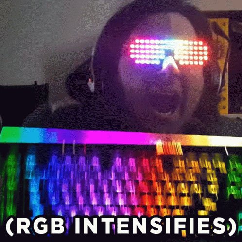

  <a href="https://atypicalesper.github.io/">
    <picture>
      <source media="(prefers-color-scheme: dark)" srcset="hello.gif" />
      <source media="(prefers-color-scheme: light)" srcset="hello-light.gif" />
      
    </picture>
  </a>

  

    <picture>
      <source media="(prefers-color-scheme: dark)" srcset="https://github-profile-trophy.vercel.app/?username=atypicalesper&theme=tokyonight&no-frame=false&no-bg=true&margin-w=4&cache_seconds=604800" />
      <source media="(prefers-color-scheme: light)" srcset="https://github-profile-trophy.vercel.app/?username=atypicalesper&theme=flat&no-frame=false&no-bg=true&margin-w=4&cache_seconds=604800" />
      
    </picture>
  

   

  <table align="center">
    <tr>
      <td>
        
      </td>
      <td>
        

          ~ Writing code, occasionally it works  
          ~ Anime enthusiast (❁´◡`❁) 
          ~ Music &amp; photography   
          ~ Mechanical keyboard enjoyer  
        

      </td>
      <td>
        
      </td>
    </tr>
  </table>

   

  

    
    
    
  

   

  

  <table width="100%">
    <tr>
      <td width="50%" align="center">
        <a href="https://github.com/atypicalesper/genlea">
          <picture>
            <source media="(prefers-color-scheme: dark)" srcset="https://github-readme-stats.vercel.app/api/pin/?username=atypicalesper&repo=genlea&theme=tokyonight&hide_border=false&cache_seconds=86400" />
            <source media="(prefers-color-scheme: light)" srcset="https://github-readme-stats.vercel.app/api/pin/?username=atypicalesper&repo=genlea&theme=default&hide_border=false&cache_seconds=86400" />
            
          </picture>
        </a>
      </td>
      <td width="50%" align="center">
        <a href="https://github.com/atypicalesper/AgentItAll">
          <picture>
            <source media="(prefers-color-scheme: dark)" srcset="https://github-readme-stats.vercel.app/api/pin/?username=atypicalesper&repo=AgentItAll&theme=tokyonight&hide_border=false&cache_seconds=86400" />
            <source media="(prefers-color-scheme: light)" srcset="https://github-readme-stats.vercel.app/api/pin/?username=atypicalesper&repo=AgentItAll&theme=default&hide_border=false&cache_seconds=86400" />
            
          </picture>
        </a>
      </td>
    </tr>
    <tr>
      <td width="50%" align="center">
        <a href="https://github.com/atypicalesper/prompt-lab">
          <picture>
            <source media="(prefers-color-scheme: dark)" srcset="https://github-readme-stats.vercel.app/api/pin/?username=atypicalesper&repo=prompt-lab&theme=tokyonight&hide_border=false&cache_seconds=86400" />
            <source media="(prefers-color-scheme: light)" srcset="https://github-readme-stats.vercel.app/api/pin/?username=atypicalesper&repo=prompt-lab&theme=default&hide_border=false&cache_seconds=86400" />
            
          </picture>
        </a>
      </td>
      <td width="50%" align="center">
        <a href="https://github.com/atypicalesper/dev-atlas">
          <picture>
            <source media="(prefers-color-scheme: dark)" srcset="https://github-readme-stats.vercel.app/api/pin/?username=atypicalesper&repo=dev-atlas&theme=tokyonight&hide_border=false&cache_seconds=86400" />
            <source media="(prefers-color-scheme: light)" srcset="https://github-readme-stats.vercel.app/api/pin/?username=atypicalesper&repo=dev-atlas&theme=default&hide_border=false&cache_seconds=86400" />
            
          </picture>
        </a>
      </td>
    </tr>
    <tr>
      <td width="50%" align="center">
        <a href="https://github.com/atypicalesper/token-savior">
          <picture>
            <source media="(prefers-color-scheme: dark)" srcset="https://github-readme-stats.vercel.app/api/pin/?username=atypicalesper&repo=token-savior&theme=tokyonight&hide_border=false&cache_seconds=86400" />
            <source media="(prefers-color-scheme: light)" srcset="https://github-readme-stats.vercel.app/api/pin/?username=atypicalesper&repo=token-savior&theme=default&hide_border=false&cache_seconds=86400" />
            
          </picture>
        </a>
      </td>
      <td width="50%" align="center">
        <a href="https://github.com/atypicalesper/vector-lens">
          <picture>
            <source media="(prefers-color-scheme: dark)" srcset="https://github-readme-stats.vercel.app/api/pin/?username=atypicalesper&repo=vector-lens&theme=tokyonight&hide_border=false&cache_seconds=86400" />
            <source media="(prefers-color-scheme: light)" srcset="https://github-readme-stats.vercel.app/api/pin/?username=atypicalesper&repo=vector-lens&theme=default&hide_border=false&cache_seconds=86400" />
            
          </picture>
        </a>
      </td>
    </tr>
  </table>

   

  

  <table width="100%">
    <tr>
      <td width="33%" valign="top" align="center">
          
        
        
        
        
        
        
        
        
        
      </td>
      <td width="33%" valign="top" align="center">
          
        
        
        
      </td>
      <td width="33%" valign="top" align="center">
          
        
        
        
        
        
        
        
        
        
      </td>
    </tr>
    <tr>
      <td width="33%" valign="top" align="center">
          
        
        
        
        
        
        
      </td>
      <td width="33%" valign="top" align="center">
          
        
        
        
        
        
        
        
        
        
      </td>
      <td width="33%" valign="top" align="center">
          
        
        
        
        
        
        
        
        
        
        
        
      </td>
    </tr>
  </table>

   

  

  

    <table>
      <tr>
        <td>
          <picture>
            <source media="(prefers-color-scheme: dark)" srcset="https://github-profile-summary-cards.vercel.app/api/cards/stats?username=atypicalesper&theme=tokyonight" />
            <source media="(prefers-color-scheme: light)" srcset="https://github-profile-summary-cards.vercel.app/api/cards/stats?username=atypicalesper&theme=github" />
            
          </picture>
        </td>
        <td>
          <picture>
            <source media="(prefers-color-scheme: dark)" srcset="https://streak-stats.demolab.com/?user=atypicalesper&theme=tokyonight&hide_border=false&cache_seconds=604800" />
            <source media="(prefers-color-scheme: light)" srcset="https://streak-stats.demolab.com/?user=atypicalesper&theme=default&hide_border=false&cache_seconds=604800" />
            
          </picture>
        </td>
      </tr>
      <tr>
        <td colspan="2" align="center">
          <picture>
            <source media="(prefers-color-scheme: dark)" srcset="https://github-profile-summary-cards.vercel.app/api/cards/repos-per-language?username=atypicalesper&theme=tokyonight" />
            <source media="(prefers-color-scheme: light)" srcset="https://github-profile-summary-cards.vercel.app/api/cards/repos-per-language?username=atypicalesper&theme=github" />
            
          </picture>
        </td>
      </tr>
    </table>
     
    <picture>
      <source media="(prefers-color-scheme: dark)" srcset="https://github-readme-activity-graph.vercel.app/graph?username=atypicalesper&theme=tokyo-night&hide_border=false&area=true" />
      <source media="(prefers-color-scheme: light)" srcset="https://github-readme-activity-graph.vercel.app/graph?username=atypicalesper&theme=github-light&hide_border=false&area=true" />
      
    </picture>
     
    <picture>
      <source media="(prefers-color-scheme: dark)" srcset="https://raw.githubusercontent.com/atypicalesper/atypicalesper/output/github-contribution-grid-snake-dark.svg" />
      <source media="(prefers-color-scheme: light)" srcset="https://raw.githubusercontent.com/atypicalesper/atypicalesper/output/github-contribution-grid-snake.svg" />
      
    </picture>
  

   

  

     
    <picture>
      <source media="(prefers-color-scheme: dark)" srcset="https://quotes-github-readme.vercel.app/api?type=horizontal&theme=tokyonight" />
      <source media="(prefers-color-scheme: light)" srcset="https://quotes-github-readme.vercel.app/api?type=horizontal&theme=light" />
      
    </picture>
     
  

   

  

    
  

